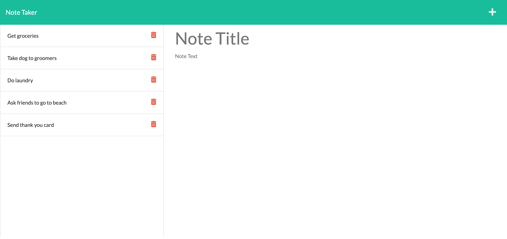
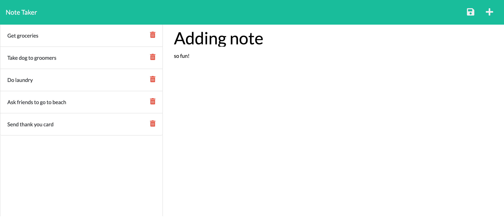
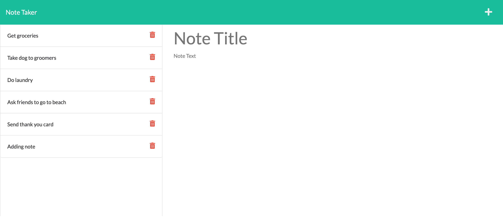

## Note Taker

# Table of Contents
- [Overview](#Overview)
- [Picture](#Picture)
- [Mock-Video](#Mock-Video)
- [Criteria](#Criteria)

---

# Overview

The goal for this challenge was to edit a starter code to create an app where a user could take notes. This is done by connecting the front end code that was given and sending it to the server in order for the information to go through routes. This challenge serves as a basic spectrum for understanding Express.js! By using routes and calling to the api, the app is able to function on the front end as well as the back end. Another great new part about this challenge was that this assignment was deployed on Heroku. Down below, you can see a couple screenshots to show that the note was added to the side as well as the video. Please keep in mind when you click on the link for the video, the quality isn't great until the video is downloaded!

As a bonus, the delete function was included for this application.

---

# Picture

---

# Mock-Video

The live link to the video can be found here:
[Link](https://drive.google.com/file/d/1WeIeQYQ-tSDtk4Mns5iqT6FL0lMJEXot/view)

(Downloading the video increases the video quality)

---

# Criteria
- GIVEN a note-taking application
- WHEN I open the Note Taker
- THEN I am presented with a landing page with a link to a notes page
- WHEN I click on the link to the notes page
- THEN I am presented with a page with existing notes listed in the left-hand column, plus empty fields to enter a new note title and the note’s text in the right-hand column
- WHEN I enter a new note title and the note’s text
- THEN a Save icon appears in the navigation at the top of the page
- WHEN I click on the Save icon
- THEN the new note I have entered is saved and appears in the left-hand column with the other existing notes
- WHEN I click on an existing note in the list in the left-hand column
- THEN that note appears in the right-hand column
- WHEN I click on the Write icon in the navigation at the top of the page
- THEN I am presented with empty fields to enter a new note title and the note’s text in the right-hand column